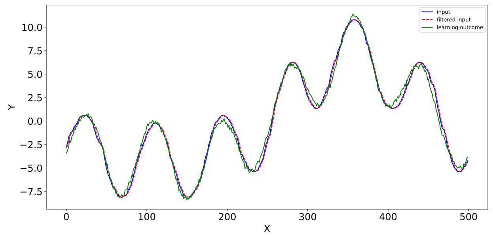
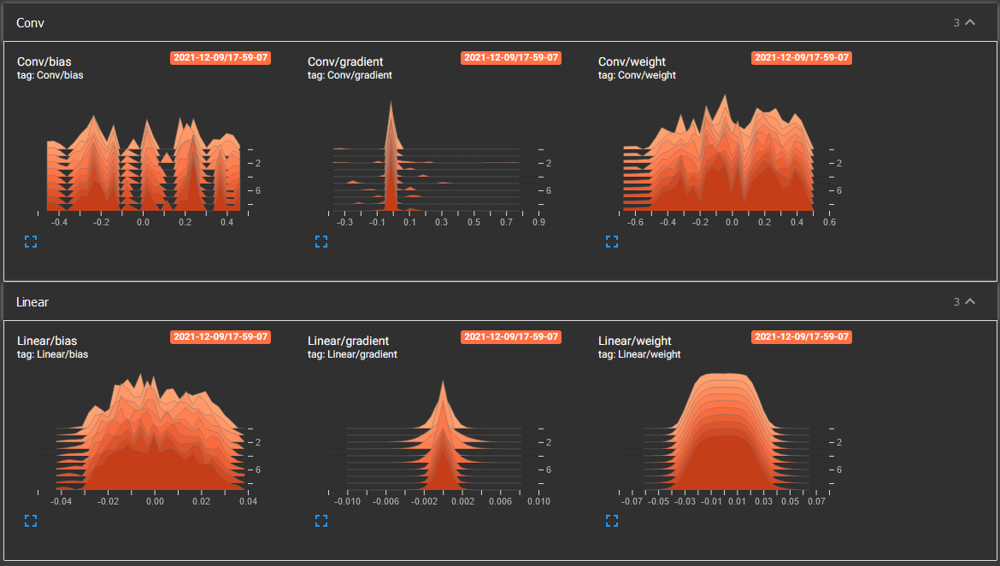

# FailNet - Simple and Robust Failure Detector

[](https://codecov.io/gh/Otteri/failnet)

FailNet is a robust failure detector that can be easily integrated to any system that produces sequential data. The detector is based on deep learning and 1D convonlution. It learns the typical behaviour of the system and then this information can be leveraged for detecting possible issues in the system. Since the system does not need to be explicitly modelled, the detector is very generic. Following image demonstrates how well the detector (green signal) can predict system inputs (blue values) just after couple seconds of training. The neural network is tiny and fast to train.



## Installation
It is recommended to first create a virtual environment, then install requirements:
```bash
$ pip install -r requirements.txt
```
This installs all required python packages and data generation environemnt. (Installation has been found to work with python 3.8.5 at least. Hopefully it works with other versions as well).

## Configuration
Model properties can be configured using `config.py`. Configuration file also allows to adjust generated data properties when using `pulsegen` environment.

## Usage
Now you should be able to train the model. Training takes couple of minutes with default configuration.
```bash
$ python main.py --make_plots
```
After training, you may inspect generated training plots in `data/predictions` directory. You can also find saved model from the `data` directory.

## ONNX
Pytorch model can be converted into ONNX model with `main.py --make_onnx`.

## Simulation environment
The detector can be tested and developed using simulation environment called
[pulsegen](https://github.com/Otteri/gym-envs). Pulsegen was used in the run examlpe. Another option is to feed recorded data for the model and use this for training.

## Testing & Linting
It is assumed that you are in the root of the repository and you have installed [pytest](https://docs.pytest.org/en/stable/), [flake8](https://pypi.org/project/flake8/) and [coverage](https://pypi.org/project/coverage/) (these are not part of requirements.txt. You can install these with pip). Then, you can call:
```bash
$ python -m pytest tests/ # run tests
$ flake8 . # run linter
$ coverage run -m pytest tests/ # run test coverage
```

## Details
It is difficult task to specify all possible failure cases beforehandedly. With FailNet, we do exactly opposite, which makes the task of detecting failure cases more manageable. We try to learn normal behaviour of the system and this knowledge allows us to detect possible failures when the system is behaving unormally.

### Imaginary use cases

**1) Freezer**  
Let's consider a very simple case where we want to measure freezer temperature with a temperature sensor. We can train the neural network with temperature sensor data right after accomplishing installation. After couple of years, we may notice that neural networks predicts different temperatures than the sensor outputs. In such case, we can conclude that either the freezer has broken or then sensor values might have drifted. Anyhow, we have detected an possible issue.

**2) Pulse width modulation (PWM)**  
In previous example, a simple if-condition might have sufficed. In this example, we consider pulse width modulation. With PWM, we can't detect issues directly from the amplitude of a signal. We must inspect PWM signal patterns. Although, this scenario is very different from previous one, we can still use the same detector for this problem. This is where the strength of neural network based detector lies in. We do not need to know much about the system itself. We only need to get input from somewhere and then compare detector-model predictions with real values.

**3) Multi-sensor system**  
Some systems can be difficult to understand, which makes modelling of these system really challenging. Luckily, we do not need to consider these relations ourselves. The neural network can do that for us. Let's pretend that we do not know about ideal gas law. In this example, we start increasing pressure in a chamber and we notice that our temperature sensor shows higher temperature. We may think that something is wrong with the sensor, but detector-model understands the situation and stays quiet. detector-model starts only complaining if temperature decreases while pressure increases.

## TensorBoard
It is possible to view model weights, biases and gradients after training with TensorBoard. Train model with `--tensorboard`  option and run: `tensorboard --logdir=data/runs` after training. If you go to `http://localhost:6006`, then you should be able to see following:

